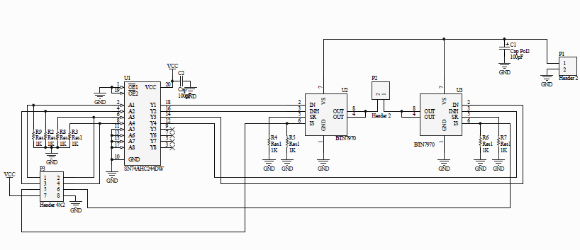

# PistonPump

Simple electronic control unit for an experimental piston pump. The DC motor speed is set as a function of time over the USB interface and simulated ModBus protocol. The STM32F103 microcontroller is used on cheap widely available board called ,,Blue Pill''.

**Version history**

| Version | Comment | Date |
| --- | --- | --- |
| V-1.0.1 | First full hardware test | 24.01.25 |

## Hardware

- STM32F103C8T6 board ,,Blue Pill''
- Full bridge motor driver HW-039 with two BTS7960 and level shifter

**The motor driver to MCU connection:**

| Motor driver pin | MCU pin | MCU function | Comment |
| --- | --- | --- | --- |
| 1 | PA8 | TIM1 OC1 | Forward PWM |
| 2 | PA9 | TIM1 OC2 | Reverse PWM |
| 3 | PB4 |  | Forward Enable |
| 4 | PB5 |  | Reverse Enable |
| 5 | reserved | reserved | Forward Current Alarm |
| 6 | reserved | reserved | Reverse Current Alarm |
| 7 |  |  | Vcc +3.3 V |
| 8 |  |  | GND |

**Peripheral HW usage**

| Block | Usage |
| --- | --- |
| USB | Communication with PC, simulated Modbus |
| SYSTICK | Communication timeouts, indication |
| TIM1 | PWM generation for DC motor control, motor control timing |

**Interrupt usage and priorities**

| Interrupt | Priority |
| --- | --- |
| USB |  |
| Systick |  |
| TIM1 |  |

**Miscellaneous parameters**

- Core clock = 48 MHz

## Modbus communication

- The device is set to constant address **22** (0x16).
- Supported operations are MB_READ_HOLDING_REGS (3), MB_READ_INPUT_REGS (4) and MB_WRITE_MULTIPLE_REGS (16)

**Input registers:**

| Address | Priority |
| --- | --- |
| 0 | System status flag field |
| 1 | System error flag field |

**Holding registers:**

| Address | Priority |
| --- | --- |
| 0 | Command |
| 1 | Forward maximal time (number of PWM cycles) if started by command |
| 2 | Forward speed (PWM duty cycle) if started by command |
| 3 | Rewind maximal time (number of PWM cycles) if started by command |
| 4 | Rewind speed (PWM duty cycle) if started by command |
| 5 | Programmable wave repeat count, for command CMD_REPEAT |
| 6 | Programmable wave repeat period in milliseconds, for command CMD_REPEAT |

**Commands**

| Command | Value | Comment |
| --- | --- | --- |
| CMD_STEP_FORWARD | 1 | Do forward step                                            |
| CMD_STEP_REWIND  | 2 | Do rewind step                                             |
| CMD_WAVE         | 3 | Do programmed wave                                         |
| CMD_CFG_SAVE     | 4 | Save the configuration to backup and reinitialize system   |
| CMD_CFG_LOAD     | 5 | Load the configuration from backup and reinitialize system |
| CMD_CFG_DEFAULT  | 6 | Restore configuration to default and reinitialize system   |
| CMD_STOP         | 7 | Emergency motor stop                                       |
| CMD_REPEAT       | 8 | Repeat programmable way by defined period and count        |

## DC Motor control

- PWM resolution is 12 bit (4096 steps from 0 to maximum voltage).
- PWM frequency is 1 kHz
(first experiments)

## ToDo

- Modbus, debug - communication timeout
- Modbus - byte oriented incoming message finder

## References

- [Brief Modbus protocol description](https://www.modbustools.com/modbus.html)
- [Python Modbus module documentation](https://pymodbus.readthedocs.io)
- [Simple but useful Modbus master - terminal application](https://qmodbus.sourceforge.net)
